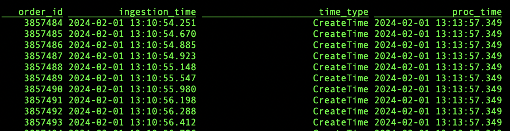

# Open Source Flink Lab 1

All required resources in Confluent Cloud must be already created for this lab to work correctly. If you haven't already, please follow the [StartHere Prerequisites](StartHere.md#step-1-setup-confluent-enviournment-using-the-below-instructions).

Local Installation of Open Source Apache Flink must be up and runnig to get started with this lab. [Flink prerequisites](StartHere.md#step-2-prerequisite-for-open-source-flink).

## Content of Lab

[1. Verify Confluent Cloud Resources](OpenSourceFlinkLab.md#1-verify-confluent-cloud-resources)

[2. Creating Flink Tables for kafka topics](OpenSourceFlinkLab.md#2-create-flink-tables-for-kafka-topics)

[3. Flink Tables](OpenSourceFlinkLab.md#3-flink-tables)

[4. Select Queries](OpenSourceFlinkLab.md#4-select-queries)

[5. Aggregations](OpenSourceFlinkLab.md#5-aggregations)

[6. Time Windows](OpenSourceFlinkLab.md#6-time-windows)

[7. Tables with Primary Key](OpenSourceFlinkLab.md#7-tables-with-primary-key)

[8. Flink Jobs](OpenSourceFlinkLab.md#8-flink-jobs)

**Advance Topics**

[1. Understand Timestamps](OpenSourceFlinkLab.md#1-understand-timestamps)

[2. Flink Joins](OpenSourceFlinkLab.md#2-flink-joins)

[3. Connecting MYSQLDB with Flink](OpenSourceFlinkLab.md#3-connect-mysqldb-with-flink)

[4. Observe Watermarks in UI](OpenSourceFlinkLab.md#4-observe-watermarks)


## 1. Verify Confluent Cloud Resources
Let's verify if all resources were created correctly and we can start using them.

### Kafka Topics
Check if the following topics exist in your Kafka cluster:
 * shoe_products (for product data aka Product Catalog),
 * shoe_customers (for customer data aka Customer CRM),
 * shoe_orders (for realtime order transactions aka Billing System).
 * shoe_order_customer_product_os (will be used to key tables)
 * shoe_products_keyed_os (will be used to key tables)
 * shoe_customers_keyed_os (will be used to key tables)


### Schemas in Schema Registry
Check if the following Avro schemas exist in your Schema Registry:
 * shoe_products-value,
 * shoe_customers-value,
 * shoe_orders-value.

NOTE: Schema Registry is at the Environment level and can be used for multiple Kafka clusters.

### Datagen Connectors
Your Kafka cluster should have three Datagen Source Connectors running. Check if their topic and template configurations match the table below.

| Connector Name (can be anything)     |      Topic      | Format |             Template | 
|--------------------------------------|:---------------:|-------:|---------------------:|
| **DatagenSourceConnector_products**  |  shoe_products  |   AVRO |            **Shoes** | 
| **DatagenSourceConnector_customers** | shoe_customers  |   AVRO |  **Shoes customers** | 
| **DatagenSourceConnector_orders**    |   shoe_orders   |   AVRO |     **Shoes orders** | 

## 2. Create Flink Tables for Kafka Topics

We need to create Flink tables to process the data from kafka, You will see later in Jan's [repo](https://github.com/griga23/shoe-store)labs that in confluent flink version this step is never required.

For this workshop, I have already added following connectors to the docker image:

1. flink-sql-connector-kafka-1.17.2.jar
2. flink-sql-avro-confluent-registry-1.17.2.jar
3. flink-faker-0.5.3.jar
4. flink-connector-jdbc-3.1.0-1.17.jar
5. mysql-connector-java-8.0.19.jar;

 Open the terminal where sql-client is already running.[You must have done completed this flinksetup, if not please do](StartHere.md#setup-using-docker).

Remember, If you ever need to drop a table use `DROP TABLE table_name;`

SQL-CLIENT currently do not support variables, so you will need to replace following values from your enviornment in all the queries:
1. username(Gloabal Key download from poral)
2. password(Gobal Secret downloaded from portal)
3. value.avro-confluent.url(fetched from env endpoint)
4. value.avro-confluent.basic-auth.user-info (Format like this: SRKey:SRSecret)


### Create `shoe_product` table: 
``` 
CREATE TABLE shoe_products (
key STRING,
id STRING NOT NULL,
brand STRING NOT NULL,
name STRING NOT NULL,
sale_price INT NOT NULL,
rating DOUBLE NOT NULL
) PARTITIONED BY (`key`)
WITH 
(
  'connector' = 'kafka',
  'topic' = 'shoe_products',
  'properties.bootstrap.servers'='pkc-7xoy1.eu-central-1.aws.confluent.cloud:9092',
  'properties.security.protocol'='SASL_SSL',
  'properties.sasl.jaas.config'='org.apache.flink.kafka.shaded.org.apache.kafka.common.security.plain.PlainLoginModule required username="WCPMDIVBYNGIIH2C" password="n1n+kx0mPXh+RA2xboO63yKE5mJNBOZDH0FpTtX0/gEon1mlqm5qNlc/eGtAZXGv";',
  'properties.sasl.mechanism'='PLAIN',
  'properties.group.id' = 'testGroup',
  'scan.startup.mode' = 'earliest-offset',
  'key.format' = 'raw',
  'key.fields'='key',
  'value.format' = 'avro-confluent',
  'value.avro-confluent.url' = 'https://psrc-xm8wx.eu-central-1.aws.confluent.cloud',
  'value.fields-include' = 'EXCEPT_KEY',
  'value.avro-confluent.basic-auth.credentials-source'='USER_INFO',
  'value.avro-confluent.basic-auth.user-info'='P5MI4D3DM4ZDEOTY:fks9JpuSV2kcYN/t/h4FmASTdoMrr+Wkcpa9aYOhAtviPAhz27BGN6bYvd1qLi8F'
);
```

### Create `shoe_orders` table:

*Don't worry about three additional metadata fields (ingestion_time/time_type/proc_time), we will discuss it later in lab. In comparision to confluent flink example treat `ingestion_time` equivalent to `$rowtime`*

``` 
CREATE TABLE shoe_orders
(
`key` VARBINARY (2147483647), 
`order_id` INT NOT NULL,
`product_id` VARCHAR(2147483647) NOT NULL,
`customer_id` VARCHAR(2147483647) NOT NULL,
`ts` TIMESTAMP(3) NOT NULL,
`ingestion_time` TIMESTAMP_LTZ(3) METADATA FROM 'timestamp',
`time_type` STRING METADATA FROM 'timestamp-type',
`proc_time` AS PROCTIME(),
 WATERMARK FOR ingestion_time AS ingestion_time - INTERVAL '5' SECOND
) PARTITIONED BY (`key`)
WITH 
(
  'connector' = 'kafka',
  'topic' = 'shoe_orders',
  'properties.bootstrap.servers'='pkc-7xoy1.eu-central-1.aws.confluent.cloud:9092',
  'properties.security.protocol'='SASL_SSL',
  'properties.sasl.jaas.config'='org.apache.flink.kafka.shaded.org.apache.kafka.common.security.plain.PlainLoginModule required username="WCPMDIVBYNGIIH2C" password="n1n+kx0mPXh+RA2xboO63yKE5mJNBOZDH0FpTtX0/gEon1mlqm5qNlc/eGtAZXGv";',
  'properties.sasl.mechanism'='PLAIN',
  'properties.group.id' = 'testGroup',
  'scan.startup.mode' = 'earliest-offset',
  'key.format' = 'raw',
  'key.fields'='key',
  'value.format' = 'avro-confluent',
  'value.avro-confluent.url' = 'https://psrc-xm8wx.eu-central-1.aws.confluent.cloud',
  'value.fields-include' = 'EXCEPT_KEY',
  'value.avro-confluent.basic-auth.credentials-source'='USER_INFO',
  'value.avro-confluent.basic-auth.user-info'='P5MI4D3DM4ZDEOTY:fks9JpuSV2kcYN/t/h4FmASTdoMrr+Wkcpa9aYOhAtviPAhz27BGN6bYvd1qLi8F'
);
```
### Create `shoe_customers` table:

```
CREATE TABLE shoe_customers (
`key` VARBINARY(2147483647),
`id` STRING NOT NULL,
`first_name` STRING NOT NULL,
`last_name` STRING NOT NULL,
`email` STRING NOT NULL,
`phone` STRING NOT NULL, 
`street_address` STRING NOT NULL,
`state` STRING NOT NULL,
`zip_code` STRING NOT NULL, 
`country` STRING NOT NULL, 
`country_code` STRING NOT NULL
) PARTITIONED BY (`key`)
WITH 
(
  'connector' = 'kafka',
  'topic' = 'shoe_customers',
  'properties.bootstrap.servers'='pkc-7xoy1.eu-central-1.aws.confluent.cloud:9092',
  'properties.security.protocol'='SASL_SSL',
  'properties.sasl.jaas.config'='org.apache.flink.kafka.shaded.org.apache.kafka.common.security.plain.PlainLoginModule required username="WCPMDIVBYNGIIH2C" password="n1n+kx0mPXh+RA2xboO63yKE5mJNBOZDH0FpTtX0/gEon1mlqm5qNlc/eGtAZXGv";',
  'properties.sasl.mechanism'='PLAIN',
  'properties.group.id' = 'testGroup',
  'scan.startup.mode' = 'earliest-offset',
  'key.format' = 'raw',
  'key.fields'='key',
  'value.format' = 'avro-confluent',
  'value.avro-confluent.url' = 'https://psrc-xm8wx.eu-central-1.aws.confluent.cloud',
  'value.fields-include' = 'EXCEPT_KEY',
  'value.avro-confluent.basic-auth.credentials-source'='USER_INFO',
  'value.avro-confluent.basic-auth.user-info'='P5MI4D3DM4ZDEOTY:fks9JpuSV2kcYN/t/h4FmASTdoMrr+Wkcpa9aYOhAtviPAhz27BGN6bYvd1qLi8F'
);
```

## 3. Flink Tables

Let's see how our created tables looks in Flink. For some sources there exists a concept of Catalog and Database, where all  the source exist automatically in Flink. You can observe that in Confluent Cloud Flink, all tables are automaticaly created inside database(cluster) and catalog(Environment). We are not configuring catalog in this workshop and hence we use defaults. 

In our example following mapping exists:
| Attribute          | OS Flink     | Confluent Flink |
| :------------   |:---------| :--- |
| Catalog    | default_catalog   | Environment
| Database        | default_database  | Cluster
| Table | Table Names     | Table+Schema|


Check if you can see your catalog (=deafault_catalog) and databases (=default_database):
```
SHOW CATALOGS;
```
```
SHOW DATABASES;
```

List all Flink Tables we have creted in previous steps:
```
SHOW TABLES;
```
Do you see catalog, database and tables like this? 


Just to revisit again, we can always learn how these tables were created:

For example if you wish to understand how the table `shoe_products` was created:
```
SHOW CREATE TABLE shoe_products;
```


You can find more information about all parameters [here.](https://nightlies.apache.org/flink/flink-docs-release-1.18/docs/dev/table/sql/create/)

### 4. Select Queries
As you are aware of while setting up the cluster, The Flink tables are populated by the Datagen connectors.

Let us first check the table schema for our `shoe_products` catalog. This should be the same as the topic schema in Schema Registry.
```
DESCRIBE shoe_products;
```

Let's check if any product records exist in the table.
```
SELECT * FROM shoe_products;
```

Now check if the `shoe_customers` schema  exists. 
```
DESCRIBE shoe_customers;
```

Are there any customers in Texas whose name starts with `B` ?
```
SELECT * FROM shoe_customers
  WHERE `state` = 'Texas' AND `last_name` LIKE 'B%';
```

Check all attributes of the `shoe_orders` table including hidden attributes.
```
DESCRIBE EXTENDED shoe_orders;
```
**Observe extras and watermark columns, read more about metadata's [here.](https://nightlies.apache.org/flink/flink-docs-release-1.18/docs/connectors/table/kafka/)**

Check the first ten orders for one customer.
```
SELECT order_id, product_id, customer_id, event_time
  FROM shoe_orders
  WHERE customer_id = 'b523f7f3-0338-4f1f-a951-a387beeb8b6a'
  LIMIT 10;
```

Don't you find it similar to SQL you have used before?

### 5. Aggregations
Let's try to run some ad-hoc advanced queries.

First find out the number of customers records and then the number of unique customers.
```
SELECT COUNT(id) AS num_customers FROM shoe_customers;
```
```
SELECT COUNT(DISTINCT id) AS num_customers FROM shoe_customers;
```

We can try some basic aggregations with the product catalog records.
For each shoe brand, find the number of shoe models, average rating and maximum model price. 
```
SELECT brand as brand_name, 
    COUNT(DISTINCT name) as models_by_brand, 
    ROUND(AVG(rating),2) as avg_rating,
    MAX(sale_price) as max_price
FROM shoe_products
GROUP BY brand;
```

NOTE: You can find more information about Flink aggregations functions [here.](https://nightlies.apache.org/flink/flink-docs-release-1.18/docs/dev/table/functions/systemfunctions/)

### 6. Time Windows

Let's try Flink's time windowing functions for shoe order records.

Column names “window_start” and “window_end” are commonly used in Flink's window operations, especially when dealing with event time windows.

Find the amount of orders for one minute intervals (tumbling window aggregation).
```
SELECT
 window_end,
 COUNT(DISTINCT order_id) AS num_orders
FROM TABLE(
   TUMBLE(TABLE shoe_orders, DESCRIPTOR(`ingestion_time`), INTERVAL '1' MINUTES))
GROUP BY window_end;
```

Find the amount of orders for ten minute intervals advanced by five minutes (hopping window aggregation).
```
SELECT
 window_start, window_end,
 COUNT(DISTINCT order_id) AS num_orders
FROM TABLE(
   HOP(TABLE shoe_orders, DESCRIPTOR(`ingestion_time`), INTERVAL '5' MINUTES, INTERVAL '10' MINUTES))
GROUP BY window_start, window_end;
```

NOTE: You can find more information about Flink Window aggregations [here.](https://nightlies.apache.org/flink/flink-docs-release-1.18/docs/dev/table/sql/queries/window-agg/)

### 7. Tables with Primary Key 

Flink allows you to define a primary key for your table. The primary key is a column whose value is unique for each record.

Let's create a new table that will store unique customers only.
```
CREATE TABLE shoe_customers_keyed_os(
  customer_id STRING,
  first_name STRING,
  last_name STRING,
  email STRING,
  PRIMARY KEY (customer_id) NOT ENFORCED
  )
WITH 
(
  'connector' = 'upsert-kafka',
  'topic' = 'shoe_customers_keyed_os',
  'properties.bootstrap.servers'='pkc-7xoy1.eu-central-1.aws.confluent.cloud:9092',
  'properties.security.protocol'='SASL_SSL',
  'properties.sasl.jaas.config'='org.apache.flink.kafka.shaded.org.apache.kafka.common.security.plain.PlainLoginModule required username="WCPMDIVBYNGIIH2C" password="n1n+kx0mPXh+RA2xboO63yKE5mJNBOZDH0FpTtX0/gEon1mlqm5qNlc/eGtAZXGv";',
  'properties.sasl.mechanism'='PLAIN',
  'properties.group.id' = 'testGroup',
  'key.format' = 'raw',
  'value.format' = 'avro-confluent',
  'value.avro-confluent.url' = 'https://psrc-xm8wx.eu-central-1.aws.confluent.cloud',
  'value.fields-include' = 'EXCEPT_KEY',
  'value.avro-confluent.basic-auth.credentials-source'='USER_INFO',
  'value.avro-confluent.basic-auth.user-info'='P5MI4D3DM4ZDEOTY:fks9JpuSV2kcYN/t/h4FmASTdoMrr+Wkcpa9aYOhAtviPAhz27BGN6bYvd1qLi8F'
);
```
Compare the new table `shoe_customers_keyed_os` with `shoe_customers`, what is the difference?

**Observe upsert kafka connector, and read [here](https://nightlies.apache.org/flink/flink-docs-release-1.18/docs/connectors/table/upsert-kafka/). Remember we have created a new topic `shoe_customers_keyed_os` as a part of Flink OS pre-requisite**


NOTE: You can find more information about primary key constraints [here.](https://nightlies.apache.org/flink/flink-docs-release-1.18/docs/dev/table/sql/create/#primary-key)

Create a new Flink job to copy customer data from the original table to the new table.
```
INSERT INTO shoe_customers_keyed_os
  SELECT id, first_name, last_name, email
    FROM shoe_customers;
```

Show the amount of cutomers in `shoe_customers_keyed`.
```
SELECT COUNT(*) as AMOUNTROWS FROM shoe_customers_keyed_os;
```
Did you see something like this?


Look up one specific customer:
```
SELECT * 
 FROM shoe_customers_keyed_os  
 WHERE customer_id = 'b523f7f3-0338-4f1f-a951-a387beeb8b6a';
```


Compare it with all customer records for one specific customer:
```
SELECT *
 FROM shoe_customers
 WHERE id = 'b523f7f3-0338-4f1f-a951-a387beeb8b6a';
```


In later labs we will also need to create Primary Key table for our product catalog.Lets do it now, 

Prepare a new table that will store unique products only:
```
CREATE TABLE shoe_products_keyed_os(
  product_id STRING,
  brand STRING,
  model STRING,
  sale_price INT,
  rating DOUBLE,
  PRIMARY KEY (product_id) NOT ENFORCED
  )
WITH 
(
  'connector' = 'upsert-kafka',
  'topic' = 'shoe_products_keyed_os',
  'properties.bootstrap.servers'='pkc-7xoy1.eu-central-1.aws.confluent.cloud:9092',
  'properties.security.protocol'='SASL_SSL',
  'properties.sasl.jaas.config'='org.apache.flink.kafka.shaded.org.apache.kafka.common.security.plain.PlainLoginModule required username="WCPMDIVBYNGIIH2C" password="n1n+kx0mPXh+RA2xboO63yKE5mJNBOZDH0FpTtX0/gEon1mlqm5qNlc/eGtAZXGv";',
  'properties.sasl.mechanism'='PLAIN',
  'properties.group.id' = 'testGroup',
  'key.format' = 'raw',
  'value.format' = 'avro-confluent',
  'value.avro-confluent.url' = 'https://psrc-xm8wx.eu-central-1.aws.confluent.cloud',
  'value.fields-include' = 'EXCEPT_KEY',
  'value.avro-confluent.basic-auth.credentials-source'='USER_INFO',
  'value.avro-confluent.basic-auth.user-info'='P5MI4D3DM4ZDEOTY:fks9JpuSV2kcYN/t/h4FmASTdoMrr+Wkcpa9aYOhAtviPAhz27BGN6bYvd1qLi8F'
);
```
**Observe using the already-created topic here `shoe_products_keyed_os`**

Create a new Flink job to copy product data from the original table to the new table. 
```
INSERT INTO shoe_products_keyed_os
  SELECT id, brand, `name`, sale_price, rating 
    FROM shoe_products;
```

Check if only a single record is returned for some product.
```
SELECT * 
 FROM shoe_products_keyed_os 
 WHERE product_id = '0fd15be0-8b95-4f19-b90b-53aabf4c49df';
```

### 8. Flink Jobs 

Now, you can finally check which jobs are still running, which jobs failed, and which stopped. 

Just use: 
```
SHOW Jobs;
```

Also, by end of this lab you must be having all these tables.

Try 
``` SHOW tables;```


# Advance Topics

### 1. Understand Timestamps
This is an important piece to understand in stream procssing. Two types of event times exist:

1. **Event Time** : This is the time of event happened, this can be contained inside the payload or we can derive this from the metadata(in kafka connectors) which can be (Create Time/ Ingestion Time based on Producer configs). This produces consistent results despite out-of-order or late events.

2. **Processing Time**: This is the Wall Clock Time of system processing the messages. This prooduces non-deterministic events and is useful in some usecases. 

We will understand both by examples here.

***EVENT TIME***

Let us, find all customer records for one customer and display the timestamps from when the events were ingested in the `shoe_customers` Kafka topic.

Open the Flink SQL CLI.

First try this:
```
DESCRIBE EXTENDED shoe_customers;
```


Did you observe you dont have any time field here, whereas in confluent flink you will find `$rowtime` automatically created.[Try it on Confluent cloud as well for more understanding!]

Let's add this colum to our existing table now,

Run this command now:

```
ALTER TABLE shoe_customers ADD (ingestion_time timestamp_ltz(3) NOT NULL metadata from 'timestamp');
```
 followed by:

 ```
DESCRIBE EXTENDED shoe_customers;
 ```

 Voila! we have added a new column with [TIMESTAMP_LTZ(3)](https://nightlies.apache.org/flink/flink-docs-master/docs/dev/table/types/#timestamp_ltz) field here, and have learned one new command [ALTER](https://nightlies.apache.org/flink/flink-docs-release-1.18/docs/dev/table/sql/alter/).
 


Now you can try this command to view event time.

```
SELECT id,ingestion_time 
FROM shoe_customers  
WHERE id = 'b523f7f3-0338-4f1f-a951-a387beeb8b6a';
```

NOTE: Check the timestamps from when the customer records were generated.

Find all orders for one customer and display the timestamps from when the events were ingested in the `shoe_orders` Kafka topic.

Note: We have already added ingestion_time in `shoe_orders` table in previous lab, so no need to add field here.
```
SELECT order_id, customer_id, ingestion_time
FROM shoe_orders
WHERE customer_id = 'b523f7f3-0338-4f1f-a951-a387beeb8b6a';
```
NOTE: Check the timestamps when the orders were generated. This is important for the join operations we will do next.

 ***Processing Time***

 The processing time is automatically inserted in table using predefined `PROCTIME()` method. To understand run following SQLs:

 ```
 DESCRIBE shoe_orders;
 ```


Observe, we already have proc_time column created during our `create table shoe_order`command. 

Now, Run this:
```
SELECT order_id,ingestion_time, time_type, proc_time from shoe_orders;
```


You should observe `proc_time` column is dispplaying you current system time & ingestion_time will show you the time that the kafka record was produced with time_type(Create Time/LogAppendTime).


## 2. Flink Joins

Flink SQL supports complex and flexible join operations over dynamic tables. There are a number of different types of joins to account for the wide variety of semantics that queries may require.
By default, the order of joins is not optimized. Tables are joined in the order in which they are specified in the FROM clause.

You can find more information about Flink SQL Joins [here.](https://nightlies.apache.org/flink/flink-docs-release-1.18/docs/dev/table/sql/queries/joins/)

Now, we can look at the different types of joins available. 
We will join `order` records and `customer` records.

Join orders with non-keyed customer records (Regular Join):
```
SELECT order_id, shoe_orders.`ingestion_time`, first_name, last_name
FROM shoe_orders
INNER JOIN shoe_customers 
ON shoe_orders.customer_id = shoe_customers.id
WHERE customer_id = 'b523f7f3-0338-4f1f-a951-a387beeb8b6a';
```

NOTE: Look at the number of rows returned. There are many duplicates!

Join orders with non-keyed customer records in some time windows (Interval Join):

```
SELECT order_id, shoe_orders.`ingestion_time`, first_name, last_name
FROM shoe_orders
INNER JOIN shoe_customers
ON shoe_orders.customer_id = shoe_customers.id
WHERE customer_id = 'b523f7f3-0338-4f1f-a951-a387beeb8b6a' AND
  shoe_orders.`ingestion_time` BETWEEN shoe_customers.`ingestion_time` - INTERVAL '1' HOUR AND shoe_customers.`ingestion_time`;
```

Join orders with keyed customer records (Regular Join with Keyed Table):
```
SELECT order_id, shoe_orders.`ingestion_time`, first_name, last_name
FROM shoe_orders
INNER JOIN shoe_customers_keyed_os
ON shoe_orders.customer_id = shoe_customers_keyed_os.customer_id
WHERE shoe_customers_keyed_os.customer_id = 'b523f7f3-0338-4f1f-a951-a387beeb8b6a';
```
NOTE: Look at the number of rows returned. There are no duplicates! This is because we have only one customer record for each customer id.

Join orders with keyed customer records at the time when order was created (Temporal Join with Keyed Table):
```
SELECT order_id, shoe_orders.`ingestion_time`, first_name, last_name
FROM shoe_orders
INNER JOIN shoe_customers_keyed_os FOR SYSTEM_TIME AS OF shoe_orders.`ingestion_time`
ON shoe_orders.customer_id = shoe_customers_keyed_os.customer_id
WHERE shoe_customers_keyed_os.customer_id = 'b523f7f3-0338-4f1f-a951-a387beeb8b6a';
```

Facing Error? Any idea?


Here 2 things are missing:

1. **Timestamp column:** As discussed previously, we can use following SQL. Run this
```
ALTER TABLE shoe_customers_keyed_os ADD (ingestion_time timestamp_ltz(3) NOT NULL metadata from 'timestamp');
```
2. **A ROWTIME attribute:** A row time attribute is a special column in a Flink table that represents the event time of each row. You can define a row time attribute and a watermark strategy using the WATERMARK statement as below or during DDL like we did in `shoe_order` table in previous lab. Run this.

```
ALTER TABLE shoe_customers_keyed_os ADD WATERMARK FOR ingestion_time AS ingestion_time - INTERVAL '5' SECOND;
```

Now your table should look like this:


NOTE 1: There might be empty result set if keyed customers tables was created after the order records were ingested in the shoe_orders topic. 

NOTE 2: You can find more information about Temporal Joins with Flink SQL [here.](https://nightlies.apache.org/flink/flink-docs-release-1.18/docs/dev/table/sql/queries/joins/#temporal-joins)

HINT: Stop INSERT into customer_keyed_os and then start the insert again with `ingestion_time`. Then rerun the query, you should see output! Think and try this, this will clear many concepts.

## 3. Connect MYSQLDB with Flink

### Change Data Capture Mode (This is a Streaming Mode- Unbounded Stream we talked about)
```
CREATE TABLE category_streaming (
       `sub_category_id` BIGINT NOT NULL,
       parent_category_name STRING,
       PRIMARY KEY (`sub_category_id`) NOT ENFORCED
     ) WITH (
 'hostname' = 'mysql',
 'connector' = 'mysql-cdc',
 'database-name' = 'flink',
 'table-name' = 'category',
 'username' = 'root',
 'password'='admin');
```

### BATCH Mode (This is Bounded Streaming Mode, we talked about)
```
 CREATE TABLE category_batch (
       `sub_category_id` BIGINT NOT NULL,
       parent_category_name STRING,
       PRIMARY KEY (`sub_category_id`) NOT ENFORCED
     ) WITH (
       'connector' = 'jdbc',
       'url' = 'jdbc:mysql://mysql:3306/flink',
   'table-name' = 'category',
       'username' = 'root',
     'password' = 'admin');

```
Try this in sequence:


```set 'execution.runtime-mode'='batch';```

```select * from category_batch;```

```select * from category_streaming;```

```set 'execution.runtime-mode'='streaming';```

```select * from category_batch;```

```select * from category_streaming;```

You should see liek this, while connecting to a database like mysqldb, we can connect using a CDC connector in a streaming mode or jdbc connector in a batch mode.


## 4. Observe Watermarks

[Note: Create a `windowed_data` topic in kafka before running this query]

Also run these  queries to understand watermarking latency vs completeness tradeoff. 

Here, we assume that we may get out of order messages upto 1 minute delay so, We will increase watermark from 5 second to 60 seconds.

Drop existing watermark from the table:

```
ALTER TABLE shoe_orders DROP WATERMARK;
```

Now, Add a new watermark to the same table,

```
ALTER TABLE shoe_orders ADD WATERMARK FOR ingestion_time AS ingestion_time - INTERVAL '60' SECOND;
```
Create a new table backed by a kafka topic to store, `window_start`, `window_end` and `order_count` columns. Also, note we are using `kafka` connector for this table, this only supports append only stream. The append only stream means it cannot handle upserts.

```
CREATE TABLE windowed_data (
`window_start` timestamp(3),`window_end` timestamp(3),
`order_count` BIGINT NOT NULL)
 WITH 
(
   'connector' = 'kafka',
   'topic' = 'windowed_data',
   'properties.bootstrap.servers'='pkc-7xoy1.eu-central-1.aws.confluent.cloud:9092',
   'properties.security.protocol'='SASL_SSL',
   'properties.sasl.jaas.config'='org.apache.flink.kafka.shaded.org.apache.kafka.common.security.plain.PlainLoginModule required username="WCPMDIVBYNGIIH2C" password="n1n+kx0mPXh+RA2xboO63yKE5mJNBOZDH0FpTtX0/gEon1mlqm5qNlc/eGtAZXGv";',
   'properties.sasl.mechanism'='PLAIN',
   'properties.group.id' = 'testGroup',
   'scan.startup.mode' = 'earliest-offset',
     'value.format' = 'avro-confluent',
   'value.avro-confluent.url' = 'https://psrc-xm8wx.eu-central-1.aws.confluent.cloud',
   'value.fields-include' = 'EXCEPT_KEY',
   'value.avro-confluent.basic-auth.credentials-source'='USER_INFO',
   'value.avro-confluent.basic-auth.user-info'='P5MI4D3DM4ZDEOTY:fks9JpuSV2kcYN/t/h4FmASTdoMrr+Wkcpa9aYOhAtviPAhz27BGN6bYvd1qLi8F'
 );
```

See the incremental updates happening in this table, based on the watermark specified in source table `shoe_orders`

```
SELECT
  window_start, window_end,
  COUNT(DISTINCT order_id) AS `order_count`
 FROM TABLE( TUMBLE(TABLE shoe_orders, DESCRIPTOR(`ingestion_time`), INTERVAL '5' MINUTES))
 GROUP BY window_start,window_end;
```

If you see error related to batch mode use this ```set 'execution.runtime-mode'='streaming';```

Remember the bounded stream have a start & end time, while unbounded do not have.

Now, when you run this query, you will see it is sucessfully submitted and you will start getting data in `windowed_data` table and appended in the topic.

```
INSERT into windowed_data SELECT
  window_start, window_end,
  COUNT(DISTINCT order_id) AS `order_count`
 FROM TABLE( TUMBLE(TABLE shoe_orders, DESCRIPTOR(`ingestion_time`), INTERVAL '5' MINUTES))
 GROUP BY window_start,window_end;
 ```
Try:

```
SELECT * from windowed_data;
```

Do you see all buckets since last minute?

Now open the webUI at http://localhost:8080, and see this job under running jobs.

You should see a watermark been updated here.

### Unbounded Stream

In the above query if we remove the `window_start` from TUMBLE Table, you will see an error.
Try this yourself, create a `unbounded_windowed_data` table similar to above and run this query, it will fail because this query will emit upserts which are not possible through kafka connector. 
```
INSERT into unbounded_windowed_data SELECT
  window_end,
  COUNT(DISTINCT order_id) AS `order_count`
 FROM TABLE( TUMBLE(TABLE shoe_orders, DESCRIPTOR(`ingestion_time`), INTERVAL '5' MINUTES))
 GROUP BY window_end;
```
That's All! I know this have been a lot, but it will take some time!

Thankyou, Don't forget to try  Svoboda's [repo](https://github.com/griga23/shoe-store). You will understand how Confluent have made flink really easy! 
