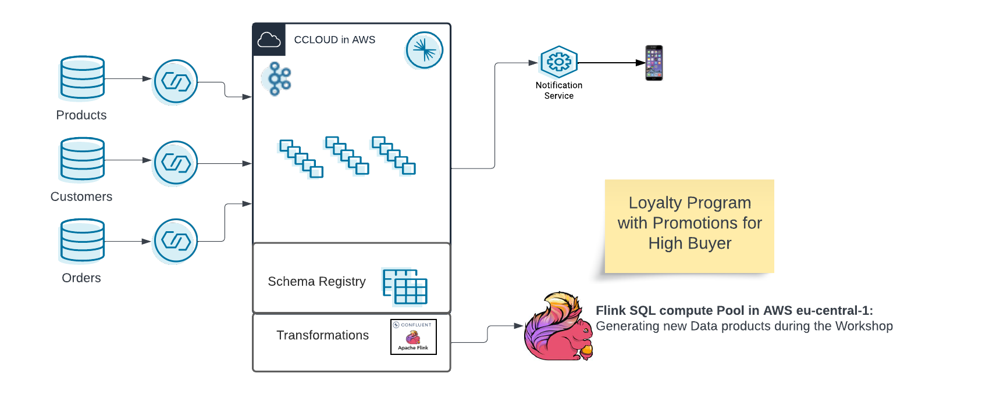

# Confluent Cloud - Flink SQL Shoe Store Workshop
Shoe Store Loyalty Engine - Flink SQL Workshop in Confluent Cloud running on AWS only

For a good preparation and first understanding, please read this [Guide to Flink SQL: An In-Depth Exploration](https://www.confluent.io/blog/getting-started-with-apache-flink-sql/) .
## Required Confluent Cloud Resources 
  * Manual creation with this [guide](prereq.md)
  * Automatated creation using Terraform  [guide](terraform/README.md)

Optional:
You can deploy the complete finished workshop with terraform. Currently the SQL Statements are not deployed, but will come very soon this year (2023) or latest beginning of 2024.  
Please follow the [guide](terraform-complete/README.md) for a complete and finished Loyalty-Program.

## Workshop Labs
  *  Lab 1: Flink Tables, Select Statements, Aggregations, Time Windows [Lab1](lab1.md)
  *  Lab 2: Join Statements, Data Enrichment, Statement Sets  [Lab2](lab2.md)

The Labs will design a loyality program within Flink SQL. The complete Mapping of dynamic Tables and Topics will be shown in next graphic.

## Notification Client 
  * Use Python Notification client [guide](notification_client.md)

## Costs
The lab execution do not consume much money. We calculated an amount of less than 10$ for a couple of hours testing.
