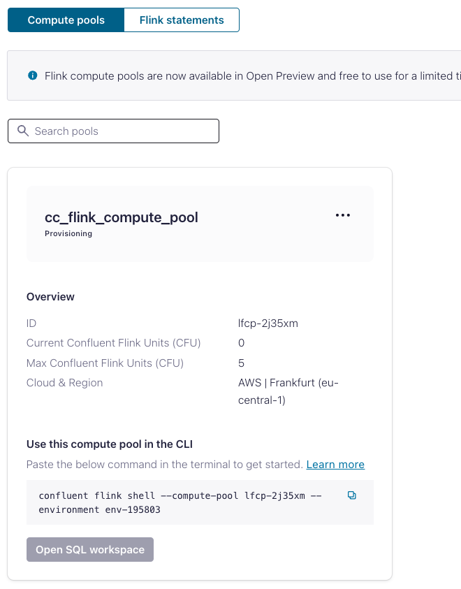
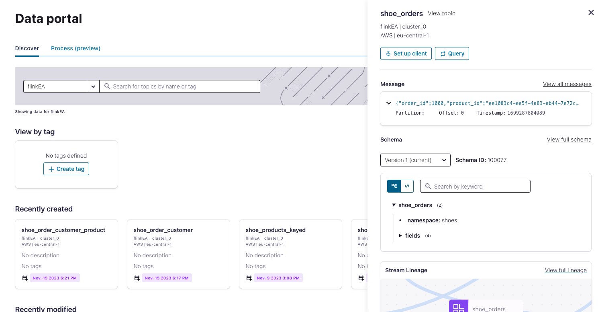
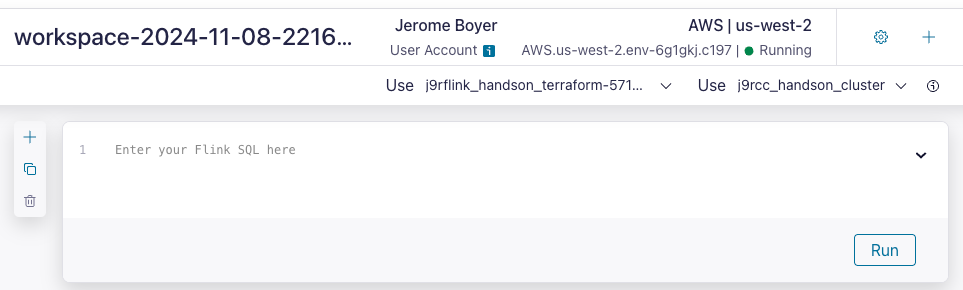
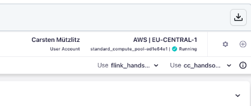
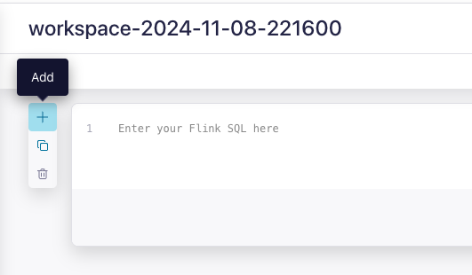
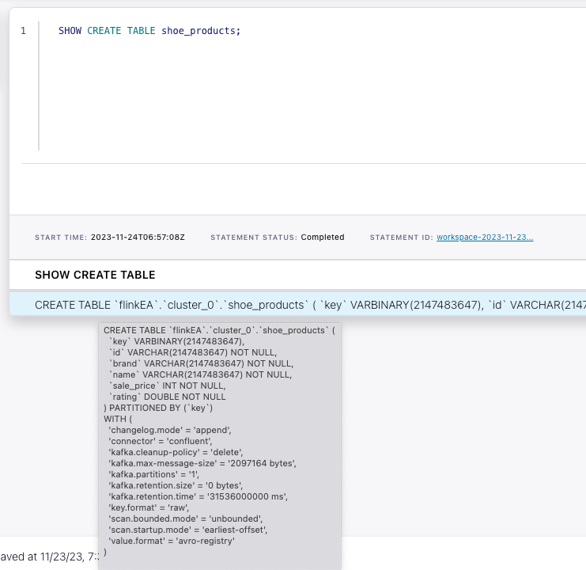
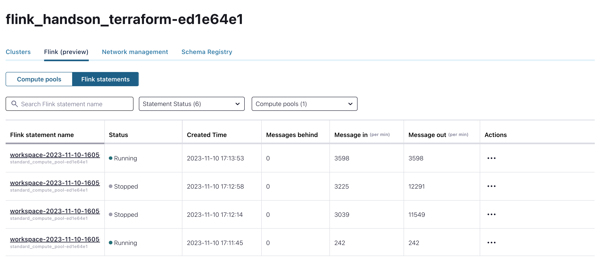

# Lab 1

## Content of Lab 1

[1. Verify Confluent Cloud Resources](lab1.md#1-verify-confluent-cloud-resources)

[2. Create Pool](lab1.md#2-create-pool)

[3. Connecting to Flink](lab1.md#3-connecting-to-flink)

[4. Flink Tables](lab1.md#4-flink-tables)

[5. Select Queries](lab1.md#5-select-queries)

[6. Aggregations](lab1.md#6-aggregations)

[7. Time Windows](lab1.md#7-time-windows)

[8. Tables with Primary Key](lab1.md#8-tables-with-primary-key)

[9. Flink Jobs](lab1.md#9-flink-jobs)

## 1. Verify Confluent Cloud Resources
Let's verify if all resources were created correctly and we can start using them in the environment `sbb-flink`.

### Kafka Topics
Check if the following topics exist in your Kafka cluster cluster_0 in in the environment `sbb-flink`:
 * shoe_products (for product data aka Product Catalog),
 * shoe_customers (for customer data aka Customer CRM),
 * shoe_orders (for realtime order transactions aka Billing System).

### Schemas in Schema Registry
Check if the following Avro schemas exist in your Schema Registry in the environment `sbb-flink`:
 * shoe_products-value,
 * shoe_customers-value,
 * shoe_orders-value.

NOTE: Schema Registry is at the Environment level and can be used for multiple Kafka clusters.

### Datagen Connectors
Your Kafka cluster should have three Datagen Source Connectors running. Check if their topic and template configurations match the table below.

| Connector Name (can be anything)     |      Topic      | Format |             Template | 
|--------------------------------------|:---------------:|-------:|---------------------:|
| **DatagenSourceConnector_products**  |  shoe_products  |   AVRO |            **Shoes** | 
| **DatagenSourceConnector_customers** | shoe_customers  |   AVRO |  **Shoes customers** | 
| **DatagenSourceConnector_orders**    |   shoe_orders   |   AVRO |     **Shoes orders** | 

## 2. Create Pool

### Create Flink Compute Pool
Create a Flink Compute Pool in environment `sbb-flink`. Now go back to environment `sbb-flink` and choose the `Flink (preview)` Tab. From there we create a new compute pool:
* choose AWS region, click `continue` and 
* enter Pool Name: `<yourname>_flink_compute_pool` with 10 Confluent Flink Units (CFU) and 
* click `Continue` button and then `Finish`.
* 
The pool will be provisioned and ready to use in a couple of moments.
AWS Pools take 1-2 minutes. Azure Pools can take 5-7 minutes.




## 3. Connecting to Flink 
You can use your web browser or console to enter Flink SQL statements.
  * **Web UI** - click on the button `Open SQL workspace` on your Flink Compute Pool
    You now have to set which catalog and database you want to use:
    - Set the environment name `sbb-flink` as catalog,
    - and the cluster name `cluster_0` as database
    
    via the dropdown boxes, see graphic below
    
    


  * **Console** - copy/paste the command from your Flink Compute Pool to the command line.    
  Of course you could also use the the Flink SQL Shell. For this, you need to have Confluent Cloud Console tool installed and be logged in with correct access rights.
  Copy the command out of the Compute Pool Window and execute it in your terminal (we prefer iterm2). 
  ```bash
  confluent flink shell --compute-pool <pool id> --environment <env-id>
  ```

NOTE: You can also access your Flink Compute Pool from the Data Portal as shown below. Just click on `Data Portal` in the main menu on the left side. Then select your Environment. You should see your topics. When you click on any of the topic tiles you can query the topic's data using Flink. 

Data Portal: Kafka Topics Tiles


Data Portal: `shoe_order` topic selected. Click on `Query` button to access your Flink Compute Pool.



## 4. Flink Tables
Let's start with exploring our Flink tables.
Kafka topics and schemas are always in sync with our Flink cluster. Any topic created in Kafka is visible directly as a table in Flink, and any table created in Flink is visible as a topic in Kafka. Effectively, Flink provides a SQL interface on top of Confluent Cloud.

Following mappings exist:
| Kafka          | Flink     | 
| ------------   |:---------:|
| Environment    | Catalog   | 
| Cluster        | Database  |
| Topic + Schema | Table     |

We will now work with the following SQL Worksheet:


Make sure you work with the correct Flink catalog (=environment) and database (=Kafka cluster).
 

If you are using console client you need to select your catalog and database:
```
USE CATALOG <MY CONFLUENT ENVIRONMENT NAME>;
```
```
USE <MY CONFLUENT KAFKA CLUSTER NAME>;
```

Check if you can see your catalog (=Environment) and databases (=Kafka Clusters):
```
SHOW CATALOGS;
```
```
SHOW DATABASES;
```

List all Flink Tables (=Kafka topics) in your Confluent Cloud cluster:
```
SHOW TABLES;
```
Do you see tables `shoe_products`, `shoe_customers`, `shoe_orders`?

You can add multiple query boxes by clicking the `+` button on the left.



Understand how the table `shoe_products` was created:
```
SHOW CREATE TABLE shoe_products;
```



You can find more information about all parameters  [here.](https://docs.confluent.io/cloud/current/flink/reference/statements/create-table.html)

### 5. Select Queries
Our Flink tables are populated by the Datagen connectors.

Let us first check the table schema for our `shoe_products` catalog. This should be the same as the topic schema in Schema Registry.
```
DESCRIBE shoe_products;
```

Let's check if any product records exist in the table.
```
SELECT * FROM shoe_products;
```

Now check if the `shoe_customers` schema  exists. 
```
DESCRIBE shoe_customers;
```

Are there any customers in Texas whose name starts with `B` ?
```
SELECT * FROM shoe_customers
  WHERE `state` = 'Texas' AND `last_name` LIKE 'B%';
```

Check all attributes of the `shoe_orders` table including hidden attributes.
```
DESCRIBE EXTENDED shoe_orders;
```

Check the first ten orders for one customer.
```
SELECT order_id, product_id, customer_id, $rowtime
  FROM shoe_orders
  WHERE customer_id = 'b523f7f3-0338-4f1f-a951-a387beeb8b6a'
  LIMIT 10;
```

### 6. Aggregations
Let's try to run more advanced queries.

First find out the number of customers records and then the number of unique customers.
```
SELECT COUNT(id) AS num_customers FROM shoe_customers;
```
```
SELECT COUNT(DISTINCT id) AS num_customers FROM shoe_customers;
```

We can try some basic aggregations with the product catalog records.
For each shoe brand, find the number of shoe models, average rating and maximum model price. 
```
SELECT brand as brand_name, 
    COUNT(DISTINCT name) as models_by_brand, 
    ROUND(AVG(rating),2) as avg_rating,
    MAX(sale_price)/100 as max_price
FROM shoe_products
GROUP BY brand;
```


NOTE: You can find more information about Flink aggregations functions [here.](https://docs.confluent.io/cloud/current/flink/reference/functions/aggregate-functions.html)

### 7. Time Windows

Let's try Flink's time windowing functions for shoe order records.
Column names “window_start” and “window_end” are commonly used in Flink's window operations, especially when dealing with event time windows.

Find the amount of orders for one minute intervals (tumbling window aggregation).
```
SELECT
 window_end,
 COUNT(DISTINCT order_id) AS num_orders
FROM TABLE(
   TUMBLE(TABLE shoe_orders, DESCRIPTOR(`$rowtime`), INTERVAL '1' MINUTES))
GROUP BY window_end;
```

Find the amount of orders for ten minute intervals advanced by five minutes (hopping window aggregation).
```
SELECT
 window_start, window_end,
 COUNT(DISTINCT order_id) AS num_orders
FROM TABLE(
   HOP(TABLE shoe_orders, DESCRIPTOR(`$rowtime`), INTERVAL '5' MINUTES, INTERVAL '10' MINUTES))
GROUP BY window_start, window_end;
```

NOTE: You can find more information about Flink Window aggregations [here.](https://docs.confluent.io/cloud/current/flink/reference/queries/window-tvf.html)

### 8. Tables with Primary Key 

Flink allows you to define a primary key for your table. The primary key is a column whose value is unique for each record.

Let's create a new table that will store unique customers only.
```
CREATE TABLE shoe_customers_keyed(
  customer_id STRING,
  first_name STRING,
  last_name STRING,
  email STRING,
  PRIMARY KEY (customer_id) NOT ENFORCED
  );
```
Compare the new table `shoe_customers_keyed` with `shoe_customers`, what is the difference?

```bash
SHOW CREATE TABLE shoe_customers_keyed;
```
We do have a different [changelog.mode](https://docs.confluent.io/cloud/current/flink/reference/statements/create-table.html#changelog-mode) and a [primary key](https://docs.confluent.io/cloud/current/flink/reference/statements/create-table.html#primary-key-constraint) constraint. What does this mean?

NOTE: You can find more information about primary key constraints [here.](https://docs.confluent.io/cloud/current/flink/reference/statements/create-table.html#primary-key-constraint)

Create a new Flink job to copy customer data from the original table to the new table.
```
INSERT INTO shoe_customers_keyed
  SELECT id, first_name, last_name, email
    FROM shoe_customers;
```

Show the amount of cutomers in `shoe_customers_keyed`.
```
SELECT COUNT(*) as AMOUNTROWS FROM shoe_customers_keyed;
```

Look up one specific customer:
```
SELECT * 
 FROM shoe_customers_keyed  
 WHERE customer_id = 'b523f7f3-0338-4f1f-a951-a387beeb8b6a';
```

Compare it with all customer records for one specific customer:
```
SELECT *
 FROM shoe_customers
 WHERE id = 'b523f7f3-0338-4f1f-a951-a387beeb8b6a';
```

We also need to create Primary Key table for our product catalog.

Prepare a new table that will store unique products only:
```
CREATE TABLE shoe_products_keyed(
  product_id STRING,
  brand STRING,
  model STRING,
  sale_price INT,
  rating DOUBLE,
  PRIMARY KEY (product_id) NOT ENFORCED
  );
```

Create a new Flink job to copy product data from the original table to the new table. 
```
INSERT INTO shoe_products_keyed
  SELECT id, brand, `name`, sale_price, rating 
    FROM shoe_products;
```

Check if only a single record is returned for some product.
```
SELECT * 
 FROM shoe_products_keyed  
 WHERE product_id = '0fd15be0-8b95-4f19-b90b-53aabf4c49df';
```

### 9. Flink Jobs 

Now, you can finally check which jobs are still running, which jobs failed, and which stopped. Go to `Flink (Preview)` in environments and choose `Flink Statements`. Check what you can do here.


You can also  use the Confluent CLI:
```bash
confluent login
confluent flink statement list --cloud aws --region eu-central-1 --environment <your env-id> --compute-pool <your pool id>
#          Creation Date         |        Name        |           Statement            | Compute Pool |  Status   |              Status Detail               
#--------------------------------+--------------------+--------------------------------+--------------+-----------+------------------------------------------
#...
# 2023-11-15 16:14:38 +0000 UTC | f041ae19-c932-403f | CREATE TABLE                   | lfcp-jvv9jq  | COMPLETED | Table 'shoe_customers_keyed'             
#                                |                    | shoe_customers_keyed(          |              |           | created                                  
#                                |                    |  customer_id STRING,           |              |           |                                          
#                                |                    | first_name STRING,   last_name |              |           |                                          
#                                |                    | STRING,   email STRING,        |              |           |                                          
#                                |                    | PRIMARY KEY (customer_id) NOT  |              |           |                                          
#                                |                    | ENFORCED   );                  |              |           |                                          
# ....
# Exceptions
confluent flink statement exception list <name> --cloud aws --region eu-central-1 --environment <your env-id>
# Descriobe Statements
confluent flink statement describe <name> --cloud aws --region eu-central-1 --environment <your env-id>
```

This is the end of Lab1, please continue with [Lab2](lab2.md).
