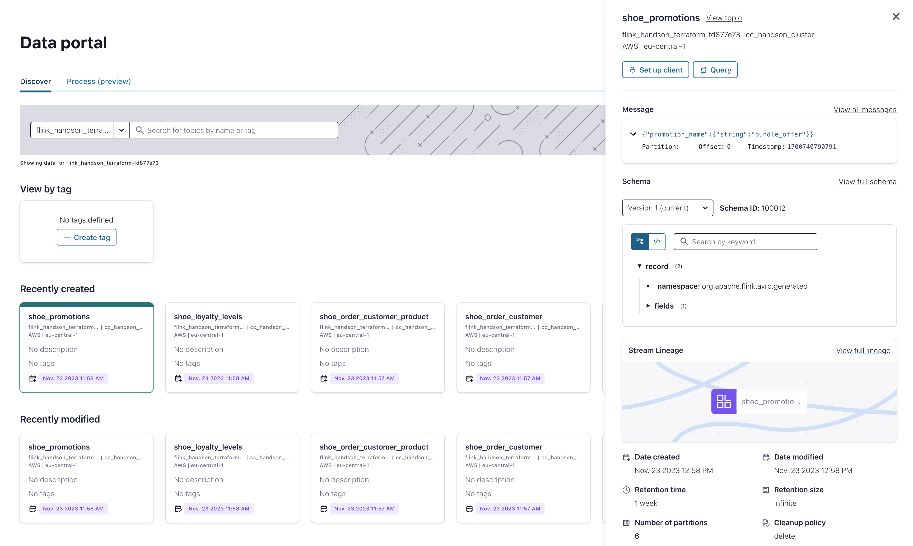

# Lab 2
Finishing Lab 1 is required for Lab 2. If you have not completed it, go back to [Lab 1](lab1.md).


[1. Flink Joins](lab2.md#1-flink-joins)

[2. Understand Timestamps](lab2.md#2-understand-timestamps)

[3. Understand Joins](lab2.md#3-understand-joins)

[4. Data Enrichment](lab2.md#4-data-enrichment)

[5. Loyalty Levels Calculation](lab2.md#5-loyalty-levels-calculation)

[6. Promotions Calculation](lab2.md#6-promotions-calculation)


## 1. Flink Joins

Flink SQL supports complex and flexible join operations over dynamic tables. There are a number of different types of joins to account for the wide variety of semantics that queries may require.
By default, the order of joins is not optimized. Tables are joined in the order in which they are specified in the FROM clause.

You can find more information about Flink SQL Joins [here.](https://docs.confluent.io/cloud/current/flink/reference/queries/joins.html)

### 2. Understand Timestamps
Let's first look at our data records and their timestamps. Open the Flink SQL workspace.

If you left the Flink SQL Workspace or refreshed the page, `catalog` and `database` dropdowns are reset. Make sure they are selected again. 


Find all customer records for one customer and display the timestamps from when the events were ingested in the `shoe_customers` Kafka topic.
```
SELECT id,$rowtime 
FROM shoe_customers  
WHERE id = 'b523f7f3-0338-4f1f-a951-a387beeb8b6a';
```
NOTE: Check the timestamps from when the customer records were generated.

Find all orders for one customer and display the timestamps from when the events were ingested in the `shoe_orders` Kafka topic.
```
SELECT order_id, customer_id, $rowtime
FROM shoe_orders
WHERE customer_id = 'b523f7f3-0338-4f1f-a951-a387beeb8b6a';
```
NOTE: Check the timestamps when the orders were generated. This is important for the join operations we will do next.

### 3. Understand Joins
Now, we can look at the different types of joins available. 
We will join `order` records and `customer` records.

Join orders with non-keyed customer records (Regular Join):
```
SELECT order_id, shoe_orders.`$rowtime`, first_name, last_name
FROM shoe_orders
INNER JOIN shoe_customers 
ON shoe_orders.customer_id = shoe_customers.id
WHERE customer_id = 'b523f7f3-0338-4f1f-a951-a387beeb8b6a';
```
NOTE: Look at the number of rows returned. There are many duplicates!

Joining infinite data streams can cause your state to grow indefinitely. Look at Time-to-live to limit the state size [here.](https://docs.confluent.io/cloud/current/flink/operate-and-deploy/best-practices.html#implement-state-time-to-live-ttl)


Join orders with non-keyed customer records in some time windows (Interval Join):
Check if there is a customer record that was created within 10 minutes after the order was created. Did customer tried to change his email after placing the order?
```
SELECT order_id, shoe_orders.`$rowtime` AS order_time, shoe_customers.`$rowtime` AS customer_record_time, email
FROM shoe_orders
INNER JOIN shoe_customers
ON shoe_orders.customer_id = shoe_customers.id
WHERE customer_id = 'b523f7f3-0338-4f1f-a951-a387beeb8b6a' AND
  shoe_orders.`$rowtime` BETWEEN shoe_customers.`$rowtime` - INTERVAL '10' MINUTES AND shoe_customers.`$rowtime`;
```

Join orders with keyed customer records (Regular Join with Keyed Table):
```
SELECT order_id, shoe_orders.`$rowtime`, first_name, last_name
FROM shoe_orders
INNER JOIN shoe_customers_keyed 
ON shoe_orders.customer_id = shoe_customers_keyed.customer_id
WHERE shoe_customers_keyed.customer_id = 'b523f7f3-0338-4f1f-a951-a387beeb8b6a';
```
NOTE: Look at the number of rows returned. There are no duplicates! This is because we have only one customer record for each customer id.

Join orders with keyed customer records at the time when order was created (Temporal Join with Keyed Table):
```
SELECT order_id, shoe_orders.`$rowtime`, first_name, last_name
FROM shoe_orders
INNER JOIN shoe_customers_keyed FOR SYSTEM_TIME AS OF shoe_orders.`$rowtime`
ON shoe_orders.customer_id = shoe_customers_keyed.customer_id
WHERE shoe_customers_keyed.customer_id = 'b523f7f3-0338-4f1f-a951-a387beeb8b6a';
```
NOTE 1: There might be empty result set if keyed customers tables was created after the order records were ingested in the shoe_orders topic. 

NOTE 2: You can find more information about Temporal Joins with Flink SQL [here.](https://docs.confluent.io/cloud/current/flink/reference/queries/joins.html#temporal-joins)

### 4. Data Enrichment
We can store the result of a join in a new table. 
We will join data from: Order, Customer, Product tables together in a single SQL statement.

Create a new table for `Order <-> Customer <-> Product` join result:
```
CREATE TABLE shoe_order_customer_product(
  order_id INT,
  first_name STRING,
  last_name STRING,
  email STRING,
  brand STRING,
  `model` STRING,
  sale_price INT,
  rating DOUBLE
)WITH (
    'changelog.mode' = 'retract'
);
```

Insert joined data from 3 tables into the new table:
```
INSERT INTO shoe_order_customer_product(
  order_id,
  first_name,
  last_name,
  email,
  brand,
  `model`,
  sale_price,
  rating)
SELECT
  so.order_id,
  sc.first_name,
  sc.last_name,
  sc.email,
  sp.brand,
  sp.`model`,
  sp.sale_price,
  sp.rating
FROM 
  shoe_orders so
  INNER JOIN shoe_customers_keyed sc 
    ON so.customer_id = sc.customer_id
  INNER JOIN shoe_products_keyed sp
    ON so.product_id = sp.product_id;
```

Verify that the data was joined successfully. 
```
SELECT * FROM shoe_order_customer_product;
```

### 5. Loyalty Levels Calculation

Now we are ready to calculate loyalty levels for our customers.

First let's see which loyalty levels are being calculated:
```
SELECT
  email,
  SUM(sale_price) AS total,
  CASE
    WHEN SUM(sale_price) > 800000 THEN 'GOLD'
    WHEN SUM(sale_price) > 70000 THEN 'SILVER'
    WHEN SUM(sale_price) > 6000 THEN 'BRONZE'
    ELSE 'CLIMBING'
  END AS rewards_level
FROM shoe_order_customer_product
GROUP BY email;
```
NOTE: You might need to change the loyalty level numbers according to the amount of the data you have already ingested.


Prepare the table for loyalty levels:
```
CREATE TABLE shoe_loyalty_levels(
  email STRING,
  total BIGINT,
  rewards_level STRING,
  PRIMARY KEY (email) NOT ENFORCED
);
```

Now you can calculate loyalty levels and store the results in the new table.
```
INSERT INTO shoe_loyalty_levels(
 email,
 total,
 rewards_level)
SELECT
  email,
  SUM(sale_price) AS total,
  CASE
    WHEN SUM(sale_price) > 80000000 THEN 'GOLD'
    WHEN SUM(sale_price) > 7000000 THEN 'SILVER'
    WHEN SUM(sale_price) > 600000 THEN 'BRONZE'
    ELSE 'CLIMBING'
  END AS rewards_level
FROM shoe_order_customer_product
GROUP BY email;
```

Verify your results:
```
SELECT * FROM shoe_loyalty_levels;
```

### 6. Promotions Calculation

Let's find out if some customers are eligible for special promotions.

Find which customer should receive a special promotion for their 10th order of the same shoe brand.
```
SELECT
   email,
   COUNT(*) AS total,
   (COUNT(*) % 10) AS sequence,
   (COUNT(*) % 10) = 0 AS next_one_free
 FROM shoe_order_customer_product
 WHERE brand = 'Jones-Stokes'
 GROUP BY email;
 ```
NOTE: We calculate the number of orders of the brand 'Jones-Stokes' for each customer and offer a free product if it's their 10th order.

Find which customers have ordered related brands in large volumes.
```
SELECT
     email,
     COLLECT(brand) AS products,
     'bundle_offer' AS promotion_name
  FROM shoe_order_customer_product
  WHERE brand IN ('Braun-Bruen', 'Will Inc')
  GROUP BY email
  HAVING COUNT(DISTINCT brand) = 2 AND COUNT(brand) > 10;
```
NOTE: We sum all orders of brands 'Braun-Bruen' and 'Will Inc' for each customer and offer a special promotion if the sum is larger than ten.  

Now we are ready to store the results for all calculated promotions. 

Create a table for promotion notifications:
```
CREATE TABLE shoe_promotions(
  email STRING,
  promotion_name STRING,
  PRIMARY KEY (email) NOT ENFORCED
);
```

Write both calculated promotions in a single statement set to the `shoe_promotions` table.

```
EXECUTE STATEMENT SET 
BEGIN

INSERT INTO shoe_promotions(email, promotion_name)
SELECT
   email,
   'next_free' AS promotion_name
FROM shoe_order_customer_product
WHERE brand = 'Jones-Stokes'
GROUP BY email
HAVING COUNT(*) % 10 = 0;

INSERT INTO shoe_promotions(email, promotion_name)
SELECT
     email,
     'bundle_offer' AS promotion_name
  FROM shoe_order_customer_product
  WHERE brand IN ('Braun-Bruen', 'Will Inc')
  GROUP BY email
  HAVING COUNT(DISTINCT brand) = 2 AND COUNT(brand) > 10;

END;
```


Check if all promotion notifications are stored correctly.
```
SELECT * from shoe_promotions;
```

All data products are created now and events are in motion. Visit the brand new data portal to get all information you need and query the data. Give it a try!



## End of Lab2.

# If you don't need your infrastructure anymore, do not forget to delete the resources!
