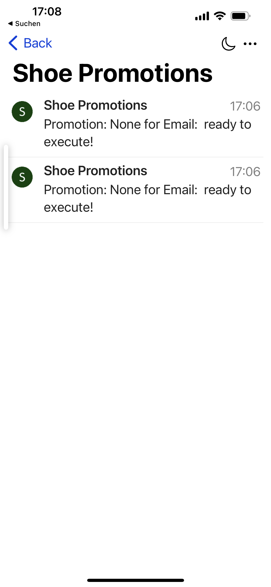
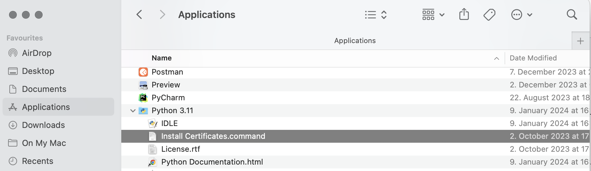

# Build a notification client 
The beauty of an event streaming platform is, when you see the the results in real-time.
We add a simple notifcation client in Python, which will consume our promotion table and send notification to your IOS mobile device.

With FLink SQL we created a loyalty program and placed all promotions in one Table.
All events are stored now in topic `shoe_promotions`.

## Prereq
- Have Python 3 running
- install important python modules
- Demo Account for Pushover

Prepare your Python
```bash
python --version
# Python 3.9.6
# Install moduls
pip install confluent-kafka
pip install http.client
pip install urllib3
pip install argparse
pip install jproperties
```

If you do not want to use Pushover, then use [Telegram](https://github.com/ora0600/apache-kafka-as-a-service-by-confluent/tree/master/webinar1). In my github repositories I do have some samples around Telegram. A fresh Signup to Pushover will get free access for a week or so.

* Install PushOver App on you iPhone
* Login into [Pushover](https://pushover.net/login)
* Add your Device
* Create a new Application (enter the name e.g. Shoe Promotions is enough) and copy the token and your user key
* Change token and user in client.properties file:

You also need to access the confluent cloud cluster. Normally a Service Account with API Key and is allowed to read  the topic show_promotions. In our Hands-on we will use the client process, which generate an API Key on our User Account:
* go to client (left side) and click `add new client` and choose python
* create API Key for Cluster click `Create Kafka cluster API Key`, set description `Python API KEY`
* create API Key for Schema Registry click `Create Schema Registry API Key`, set description `Python Schema API KEY`
* click `Copy` and you have the complete configuration to connect to your confluent cloud cluster, store this into file `client.properties`

We only need these properties in client.properties (if you run terraform-complete the client.properties file will be generated) :
```bash
bootstrap.servers=<BROKER>
security.protocol=SASL_SSL
sasl.mechanisms=PLAIN
sasl.username=<API KEY>
sasl.password=<API SECRET>
session.timeout.ms=45000
schema.registry.url=<SR URL>
basic.auth.credentials.source=USER_INFO
basic.auth.user.info=<SRKEY:SRSECRET>
group.id=shoe_promotions
auto.offset.reset=earliest
```

Create property File for Push-Over `pushover.properties`. We configured max messages to be send to 10.:
```bash
token=<push-over token key>
user=<push-over user key>
max_message=10
```

## Python Notifcation Service
start notification service and check what is happening on your iPhone
```bash
python push2ios.py f- client.properties t- shoe_promotions
...
```

The notification looks like this (only with content).



## ERROR
If you get this error:
```bash
...
ssl.SSLCertVerificationError: [SSL: CERTIFICATE_VERIFY_FAILED] certificate verify failed: unable to get local issuer certificate (_ssl.c:1006)
...
```

Then go to Python Folder and execute `Install Certificate.command`


End Lab
