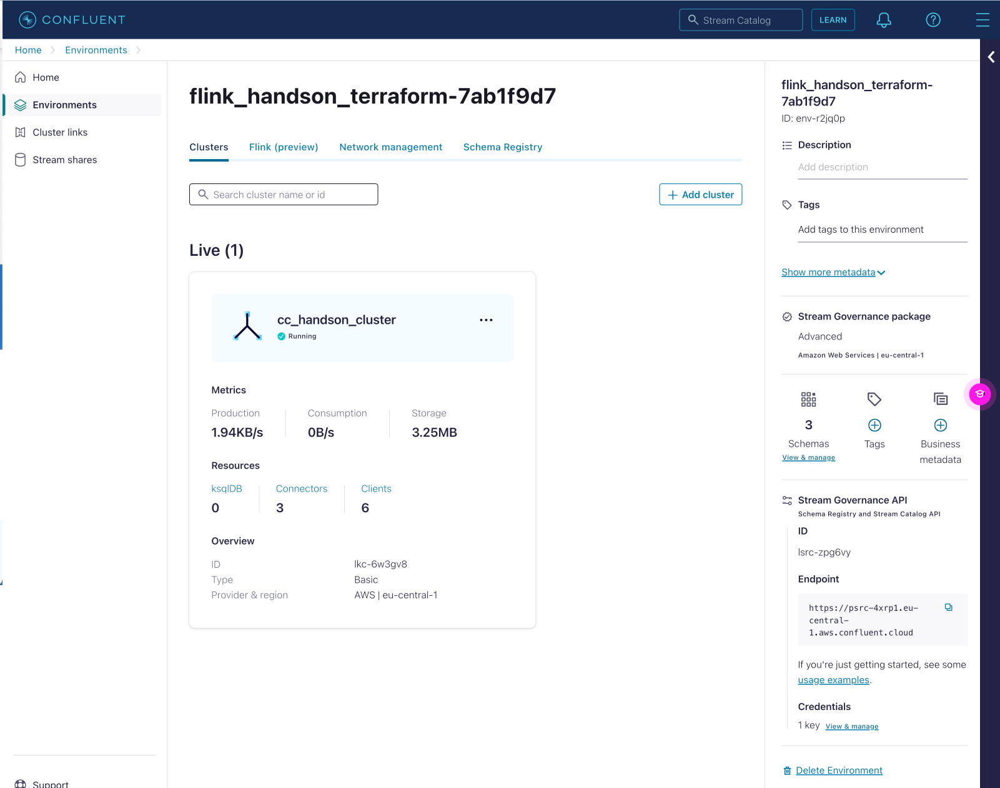

# Workshop Deployment via terraform

IMPORTANT TO KNOW FOR THE WORKSHOP:
We run in AWS and Azure only. Currently we do support [13 Regions](https://docs.confluent.io/cloud/current/flink/op-supported-features-and-limitations.html#cloud-regions) within AWS and Azure cloud. GCP is coming soon.
Please be aware that the cluster and the Flink Pool need to be in the same Cloud-Provider-Region.

This is the deployment of confluent cloud infrastructure resources to run the Flink SQL Hands-on Workshop.
We will deploy with terraform:
 - Environment:
     - Name: flink_hands-on+UUID
     - with enabled Schema Registry (essentails) in AWS region (eu-central-1)
 - Confluent Cloud Basic Cloud: cc_handson_cluster
    - in AWS in region (eu-central-1)
 - Connectors:
    - Datagen for shoe_products
    - Datagen for shoe_customers 
    - Datagen for show_orders
 - Service Accounts
    - app_manager-XXXX with Role EnvironmentAdmin
    - sr-XXXX with Role EnvironmentAdmin
    - clients-XXXX with Role CloudClusterAdmin
    - connectors-XXXX
- Topics
    - shoe_orders
    - shoe_products
    - shoe_customers
    - shoe_order_customer_product_os
    - shoe_products_keyed_os
    - shoe_customers_keyed_os
 


# Pre-requisites
- User account on [Confluent Cloud](https://www.confluent.io/confluent-cloud/tryfree)
- Local install of [Terraform](https://www.terraform.io) (details below)
- Local install of [jq](https://jqlang.github.io/jq/download) (details below)
- Local install Confluent CLI, [install the cli](https://docs.confluent.io/confluent-cli/current/install.html) 
- Create API Key in Confluent Cloud via CLI:
    ```bash
    confluent login
    confluent api-key create --resource cloud --description "API for terraform"
    # It may take a couple of minutes for the API key to be ready.
    # Save the API key and secret. The secret is not retrievable later.
    #+------------+------------------------------------------------------------------+
    #| API Key    | <your generated key>                                             |
    #| API Secret | <your generated secret>                                          |
    #+------------+------------------------------------------------------------------+
    ``````
 - Or visit the [Cloud API Key](https://confluent.cloud/settings/api-keys) page to create a Cloud API Key for your user, if you don't have any yet.

# Installation (only need to do that once)

## Install Terraform on MacOS
```
brew tap hashicorp/tap
brew install hashicorp/tap/terraform
brew update
brew upgrade hashicorp/tap/terraform
```
If you are running Windows, please use this [guide](https://learn.microsoft.com/en-us/azure/developer/terraform/get-started-windows-bash?tabs=bash) <br>
If you are running on Ubuntu (or WSL2 with Ubuntu), please use this [guide](https://computingforgeeks.com/how-to-install-terraform-on-ubuntu/)

This tutorial was tested with Terraform v1.6.4 and confluent terraform provider 1.55.0 . To upgrade terraform on MacOS use
```bash
brew upgrade terraform
```
Or download new version from [website](https://www.terraform.io/downloads.html)

## Install jq
```
brew install jq
```
If you are running Windows, download from [here](https://jqlang.github.io/jq/download/) <br>
If you are running on Ubuntu (or WSL2 with Ubuntu), please follow the instructions [here](https://lindevs.com/install-jq-on-ubuntu)

## Install Confluent Cli
Please install the Confluent CLI, with these [instructions](https://docs.confluent.io/confluent-cli/current/install.html) 
```
brew install confluentinc/tap/cli
```

This tutorial was tested with Confluent CLI v3.41.0.

# Provision services for the demo

Clone the repo on your desktop.
```bash
cd $HOME # or where-ever directory you want to use
git clone https://github.com/ravitomar7/shoe-store.git
cd shoe-store
```

## Set environment variables
- Add your API key to the Terraform variables by creating a tfvars file
```bash
cat > $PWD/terraform/terraform.tfvars <<EOF
confluent_cloud_api_key = "{Cloud API Key}"
confluent_cloud_api_secret = "{Cloud API Key Secret}"
EOF
```

## Deploy via terraform
run the following commands:
```Bash
cd ./terraform
terraform init
terraform plan
terraform apply
# Apply shows you what will be provision, enter yes to continue provisioning 
terraform output -json
# for sensitive data
terraform output -raw SRSecret
terraform output -raw AppManagerSecret
terraform output -raw ClientSecret
```

Please check whether the terraform execution went without errors.

You can copy the login instruction also from the UI.

To continue with the UI:
 - Access Confluent Cloud WebUI: https://confluent.cloud/login
 - Access your Environment: `flink_handson_terraform-XXXXXXXX`

**You can continue [here](../StartHere.md#grab-your-credentials)**


Once done you can use below instructions to destroy your infrastructure.

# Destroy the hands.on infrastructure
```bash
terraform destroy
```
There could be a conflict destroying everything with our Tags. In this case destroy again via terraform.
```bash
#╷
#│ Error: error deleting Tag "<tagID>/PII": 409 Conflict
#│ 
#│ 
#╵
#╷
#│ Error: error deleting Tag "<tagID>/Public": 409 Conflict
#│ 
#│ 
#╵
# destroy again
terraform destroy
``` 
