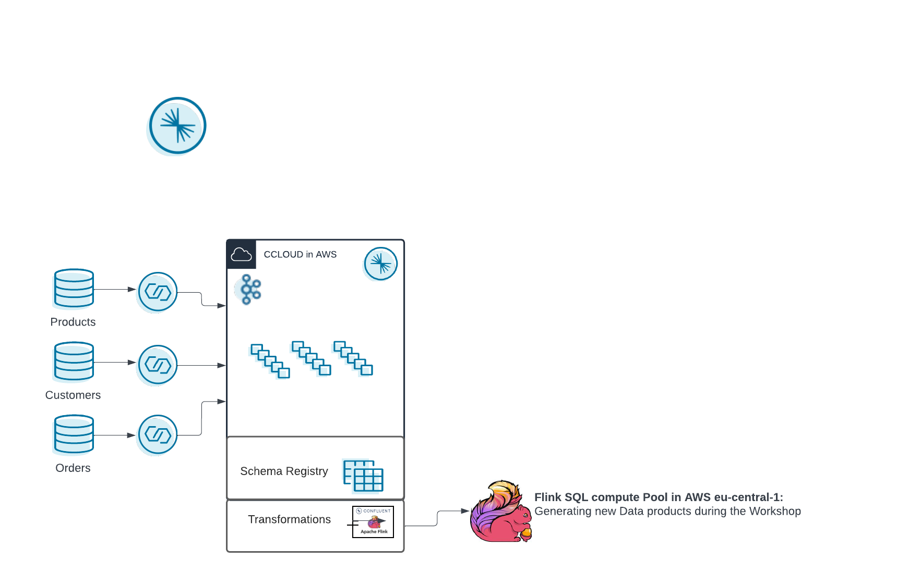

# Workshop Deployment via terraform

This is the deployment of a confluent cloud infrastructure to run the Hands-on Workshop.
a demo to try out Flink on Confluent Cloud.
We will deploy with terraform:
 - Environment:
     - Name: flink_hands-on+UUID
     - with enabled Schema Registry (advanced) in AWS region (eu-central-1)
 - Confluent Cloud Basic Cloud:
    - in AWS in region (eu-central-1)
 - Connectors:
    - Datagen for shoe_products
    - Datagen for shoe_customers 
    - Datagen for show_orders
 - Service Accounts
    - app_manager-XXXX with Role EnvironmentAdmin
    - sr-XXXX with Role EnvironmentAdmin
    - clients-XXXX with Role CloudClusterAdmin
    - connectors-XXXX



# Pre-requisites
- User account on [Confluent Cloud](https://www.confluent.io/confluent-cloud/tryfree)
- Local install of [Terraform](https://www.terraform.io) (details below)
- Local install of [jq](https://jqlang.github.io/jq/download) (details below)
- Create API Key in Confluent Cloud []()
    ```bash
    confluent login
    confluent api-key create --resource cloud --description "API for terraform"
    # It may take a couple of minutes for the API key to be ready.
    # Save the API key and secret. The secret is not retrievable later.
    #+------------+------------------------------------------------------------------+
    #| API Key    | <your generated key>                                             |
    #| API Secret | <your generated secret>                                          |
    #+------------+------------------------------------------------------------------+
    ``````

# Installation (only need to do that once)

## Install Terraform on MacOS
```
brew tap hashicorp/tap
brew install hashicorp/tap/terraform
brew update
brew upgrade hashicorp/tap/terraform
```
If you are running Windows, please this [guide](https://learn.microsoft.com/en-us/azure/developer/terraform/get-started-windows-bash?tabs=bash)

## Install jq
```
brew install jq
```
For Windows User download from [here](https://jqlang.github.io/jq/download/)

# Provision services for the demo

## Set environment variables
- Create file `.env`
```bash
#!/bin/bash

# Confluent Cloud
export CONFLUENT_CLOUD_API_KEY=<Enter credentials here>
export CONFLUENT_CLOUD_API_SECRET=<Enter credentials here>

```

## Deploy via terraform
run the following commands:
```Bash
source .env
terraform init
terraform plan
terraform apply --auto-approve
terraform output -json
```

## Flink Compute Pool
 - Access Confluent Cloud WebUI: https://confluent.cloud/login
 - Access your Environment: `flink_handson_terraform-XXXXXXXX`
 - Select tab `Flink (preview)`
 - Access your Flink Compute Pool: `standard_compute_pool-XXXXXXXX`
 - Click `Open SQL workspace`
 - Make sure to select:
   - Catalog: `flink_handson_terraform-XXXXXXXX`
   - Database: `cc-handson-cluster`
 - Submit the following SQL queries (one at a time):
```

Now, everything is up and running for the hands-on.


# Destroy the hands.on infrastructure
```bash
terraform destroy
``````